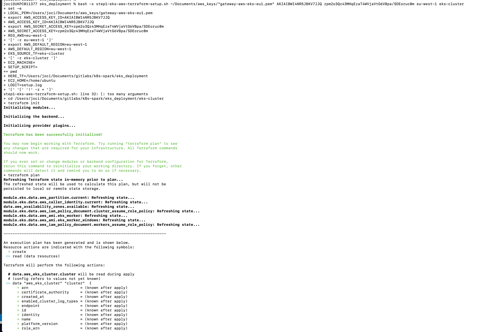
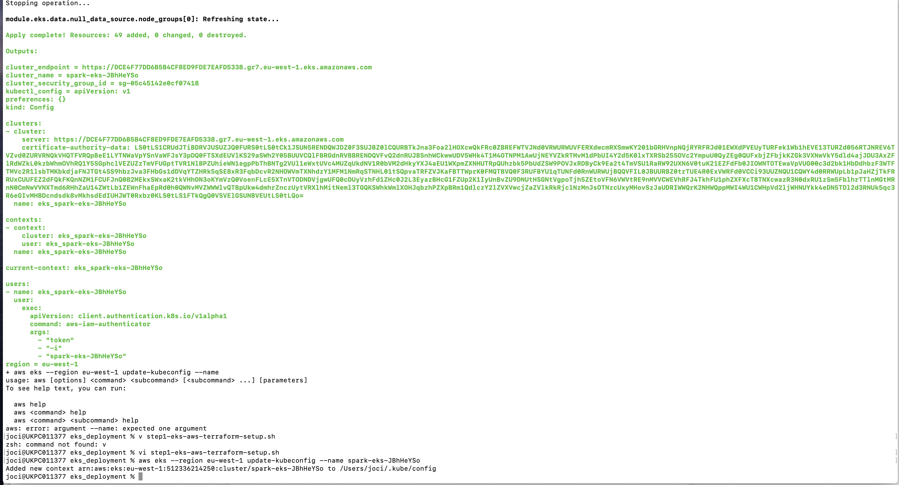
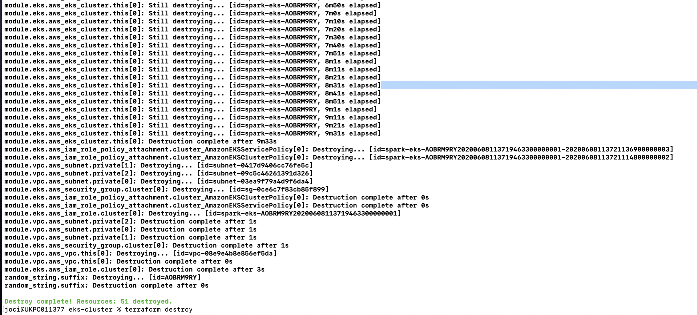
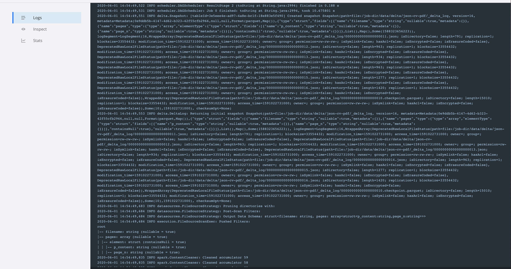
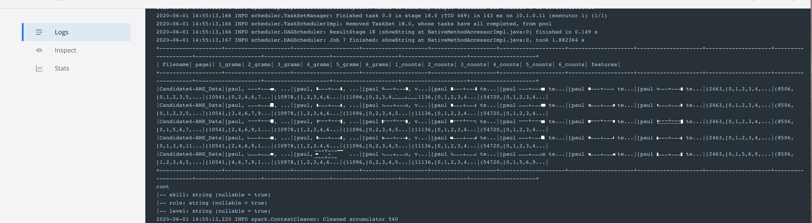

 -  The Standard k8s-spark execution from GKS adapted here to run in AWS-EKS :- Adopt Multi-Cloud Strategies with this Technologies

       Step 0 : $ brew install awscli
                $ aws configure

   In AWS/EKS core - Execution  with Terraform deployment - analysis

         1. Setup implies the availability in an EC2 Gateway and setup of an EKS Kubernetes cluster

           i. Follow example in folder eks_deployment with script 
           i.a. [eks_deployment] $ bash -x step1-setup-terraform.sh  VAR1:_YOUR_LOCAL.pem   VAR2:_AWS_ACCESS_KEY_ID   VAR3:_AWS_SECRET_ACCESS_KEY   VAR4:_AWS_REGION  VAR5:_EKS_TF_CONFIG  

  
  
  
  

         2. Use Terraform destroy in folder eks_deployment/eks-cluster

           i.a.  [eks-cluster] $  terraform destroy

   
   

         3. Deployment of Kubernetes infrastructure with AWS CLI
 
           i. confirm in ' aws eks '  the context when your cluster deployed
           i.a. [eks-cluster] $  aws eks --region eu-west-1 update-kubeconfig --name spark-eks-QiTsE99z 
             a.               $  Added new context arn:aws:eks:eu-west-1:512336214250:cluster/spark-eks-QiTsE99z to /Users/joci/.kube/config

  

         4. AWS Console - EKS regional setup detials for Spark-EKS-Version.x.y.z

 
  

         5. using kubectl activate token and login to Kubernetes console

  

 -  K8S workloads
    Where All operations executed in order :

   ./setup-k8s-spark-workload.sh

         1. spark/install-spark-kubernetes-operator
         2. spark/create-spark-service-account

  

   ./execute-k8s-spark-workload.sh

         3. default spark-py-pi   OR  pyspark job under folder /jobs 

           i.   spark/run-spark-pi-2k8s-pods
           ii. e.g. ./execute-k8s-spark-workload.sh dataminer-categorized-pdf-to-csv-analytics

   In Kubernetes Proxy - Execution Analysis and logs
  
  

   In Docker/Kubernetes core - Execution analysis

  
  
  
  
  
  

   Spark Running on Kubernetes

    i. Follow latest Spark.2.4.5 in : https://spark.apache.org/docs/latest/running-on-kubernetes.html 

   Spark Operator from GCP
    i.  https://github.com/GoogleCloudPlatform/spark-on-k8s-operator/blob/master/docs/api-docs.md 
    ii. sparkctl (dedicated kubectl) available from : https://github.com/GoogleCloudPlatform/spark-on-k8s-operator/tree/master/sparkctl

   EKS Operator for Terraform from Hashicorp HCL website
    i.  https://learn.hashicorp.com/terraform/kubernetes/provision-eks-cluster

 
   Next To\Do : adapted benchmark to EKS AKS with an dedicated sa3 S3 access layer for spark-executors/pods for filesystem. At the moment works in Spark with K8S filesystem
  
   Aditional Notes :  checkout branch execution_with_datapoints for data executions
  
   Aditional literature : Apache Spark in Kubernetes with Fast S3 access layer s3a : https://towardsdatascience.com/apache-spark-with-kubernetes-and-fast-s3-access-27e64eb14e0f
